

# 8_Puzzle_Visualize
 ## Đồ án cá nhân Trí tuệ nhân tạo

 ### Sinh viên thực hiện
 **Họ và tên:** Ninh Thị Mỹ Hạnh

 **MSSV:** 23110210

## 1. Mục Tiêu

- Giải quyết bài toán 8-Puzzle bằng các thuật toán tìm kiếm AI.
- Đánh giá và so sánh hiệu suất thuật toán dựa trên các tiêu chí khác nhau.
- Xây dựng giao diện bằng Tkinter để dễ dàng quan sát cách hoạt động.

## 2. Nội Dung

### 2.1. Các Thuật Toán Tìm Kiếm Không Có Thông Tin

#### Thành Phần Chính

- **Trạng Thái Ban Đầu**: Bảng 3x3 chứa các số từ 0 đến 8, do người dùng nhập (hợp lệ).
- **Trạng Thái Mục Tiêu**: `[1, 2, 3, 4, 5, 6, 7, 8, 0]`.
- **Không Gian Trạng Thái**: Tập hợp tất cả các trạng thái có thể đạt được từ trạng thái ban đầu.
- **Hành Động**: Di chuyển ô trống (0) lên, xuống, trái, hoặc phải.
- **Hàm Chuyển Đổi**:
  - Tìm vị trí ô trống.
  - Kiểm tra tính hợp lệ của di chuyển.
  - Hoán đổi ô trống với ô liền kề.
  - Chuyển trạng thái thành tuple để lưu trữ.
- **Hàm Chi Phí**: (lên: 1, xuống: 2, trái: 3, phải: 4).

#### Thuật Toán

1. **Breadth-First Search (BFS)**:
   - Duyệt theo chiều rộng bằng hàng đợi FIFO.
   - 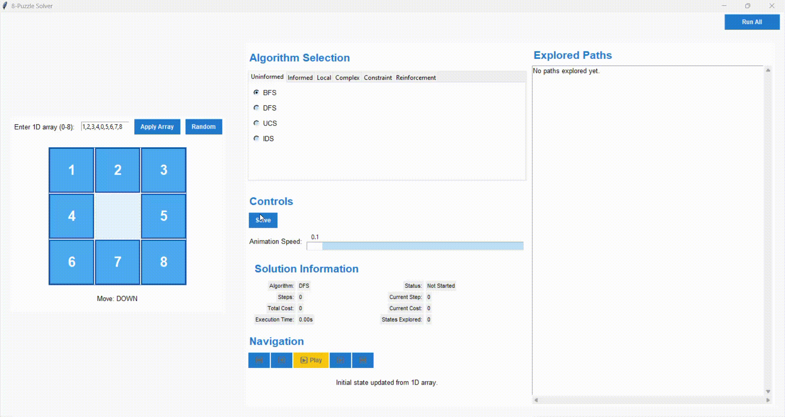
2. **Depth-First Search (DFS)**:
   - Duyệt theo chiều sâu bằng đệ quy, giới hạn độ sâu để tránh vòng lặp vô hạn.
   - 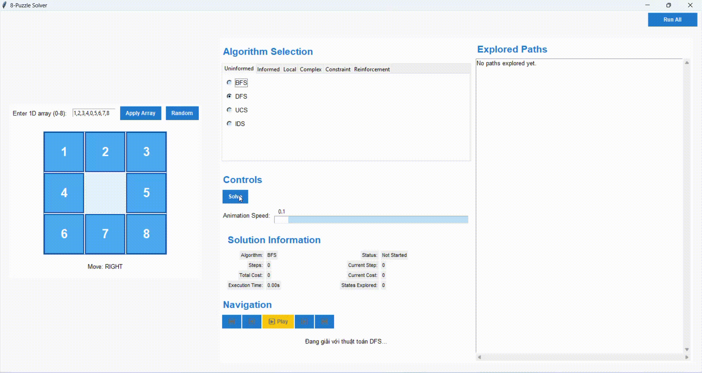
3. **Uniform-Cost Search (UCS)**:
   - Mở rộng trạng thái có chi phí thấp nhất bằng hàng đợi ưu tiên.
   -
4. **Iterative Deepening Search (IDS)**:
   - Kết hợp DFS và BFS, tăng dần độ sâu tìm kiếm.
   -
#### Giải Pháp

- Trả về đường đi từ trạng thái ban đầu đến mục tiêu, bao gồm danh sách trạng thái và chi phí tương ứng. Nếu không tìm thấy giải pháp, trả về danh sách rỗng.

#### Nhận Xét

- DFS sinh ra quá nhiều không gian trạng thái, dẫn đến trường hợp phức tạp sẽ không giải được.

### 2.2. Các Thuật Toán Tìm Kiếm Có Thông Tin

#### Thành Phần Chính

- Tương tự như nhóm không có thông tin, với thêm:
  - **Hàm Heuristic**: Sử dụng Manhattan Distance để ước tính khoảng cách từ trạng thái hiện tại đến mục tiêu.

#### Thuật Toán

1. **Greedy Search**:
   - Chọn trạng thái có giá trị heuristic thấp nhất bằng hàng đợi ưu tiên.
    -
2. **A* Search**:
   - Kết hợp chi phí đã đi (g) và ước lượng đến đích (h) để tính f = g + h.
   -
3. **Iterative Deepening A* (IDA*)**:
   - Sử dụng tìm kiếm theo chiều sâu với giới hạn dựa trên giá trị f.
   -

#### Giải Pháp

- Trả về đường đi từ trạng thái ban đầu đến mục tiêu, cùng số trạng thái đã duyệt. Nếu không tìm thấy, trả về danh sách rỗng.

#### Nhận Xét

- Greedy sinh ra ít trạng thái, giải nhanh nhưng chưa chắc ít bước nhất.

### 2.3. Các Thuật Toán Tìm Kiếm Cục Bộ

#### Thành Phần Chính

- Tương tự các nhóm trước, với thêm:
  - **Hàm Đánh Giá**:
    - Manhattan Distance để đánh giá độ tốt của trạng thái.
    - Fitness Function (cho Genetic Algorithm): `fitness = -heuristic`.
  - **Hàm Nhiệt Độ** (cho Simulated Annealing): Giảm dần để kiểm soát xác suất chấp nhận trạng thái kém hơn.

#### Thuật Toán

1. **Simple Hill Climbing**:
   - Chọn trạng thái lân cận tốt nhất nhưng dễ mắc kẹt ở cực tiểu cục bộ.
   - 
2. **Steepest Ascent Hill Climbing**:
   - Xem xét tất cả trạng thái lân cận, chọn cái tốt nhất.
   - Cải thiện so với Simple Hill Climbing nhưng vẫn có nguy cơ mắc kẹt.
   - 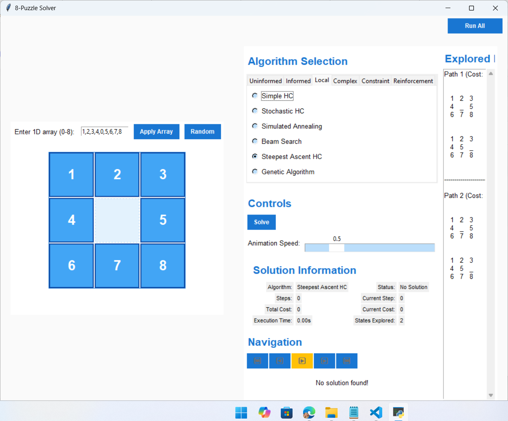
3. **Stochastic Hill Climbing**:
   - Chọn ngẫu nhiên trạng thái lân cận tốt hơn, giảm nguy cơ mắc kẹt.
   - 
4. **Simulated Annealing**:
   - Chấp nhận trạng thái kém hơn với xác suất giảm dần, tránh cực tiểu cục bộ.
   - 
5. **Beam Search**:
   - Giữ một số trạng thái tốt nhất (beam width) tại mỗi bước.
   - Tiết kiệm bộ nhớ nhưng có thể bỏ sót giải pháp.
   - 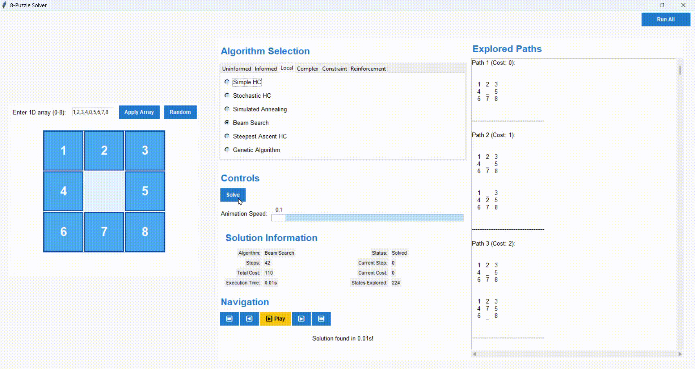
6. **Genetic Algorithm**:
   - Tạo quần thể trạng thái, tiến hóa qua lai ghép và đột biến.
   - Khám phá không gian trạng thái rộng nhưng không đảm bảo tối ưu.
   - 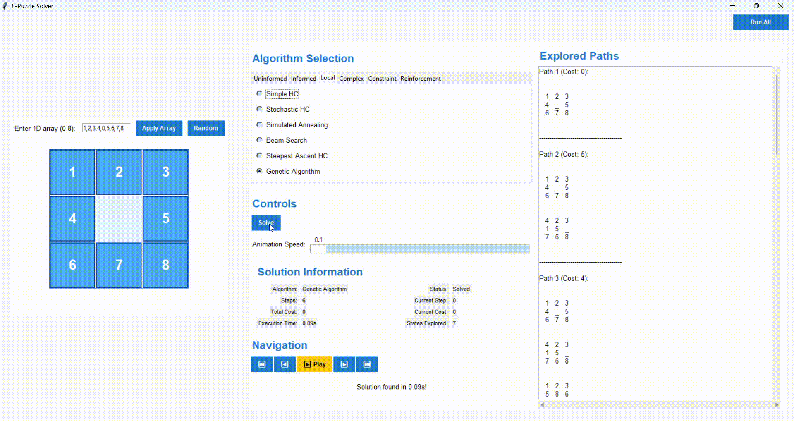
#### Giải Pháp

- Trả về đường đi từ trạng thái ban đầu đến mục tiêu, cùng số trạng thái đã duyệt. Nếu không tìm thấy, trả về danh sách rỗng.

#### Nhận Xét

- Dễ bị mắc kẹt, không đưa ra hướng giải tối ưu.

### 2.4. Các Thuật Toán Tìm Kiếm Trong Môi Trường Phức Tạp

#### Thành Phần Chính

- **Trạng Thái Ban Đầu**: Tập hợp các trạng thái khởi tạo (belief states) trong bài toán No Observation hoặc Partially Observable.
- **Trạng Thái Mục Tiêu**: Tập hợp trạng thái mục tiêu với xác suất cao.
- **Không Gian Trạng Thái**: Mở rộng thành các belief states (phân phối xác suất trên trạng thái vật lý).
- **Hàm Quan Sát** (cho Partially Observable): Mô hình hóa khả năng nhận quan sát.
- **Hàm Thưởng** (cho Partially Observable): Đánh giá trạng thái đạt mục tiêu hoặc không.
- **Hàm Heuristic**: Trung bình Manhattan Distance của các belief states.

#### Thuật Toán

1. **AND-OR Graph Search**:
   - Kết hợp OR nodes (hành động) và AND nodes (kết quả hành động).
   - Phù hợp với môi trường chắc chắn.
   - 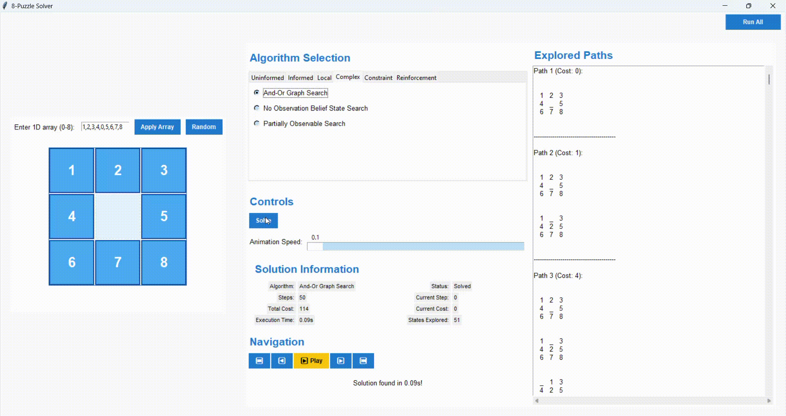
2. **Partially Observable Search**:
   - Áp dụng A* trên belief states, cập nhật dựa trên xác suất quan sát.
   - 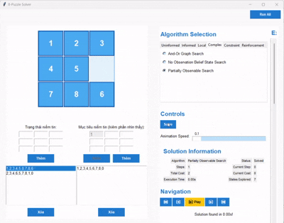
3. **No Observation Belief State Search**:
   - Áp dụng A* trên belief states mà không có thông tin quan sát.
   - Đảm bảo mọi trạng thái trong belief state đạt mục tiêu.
   - 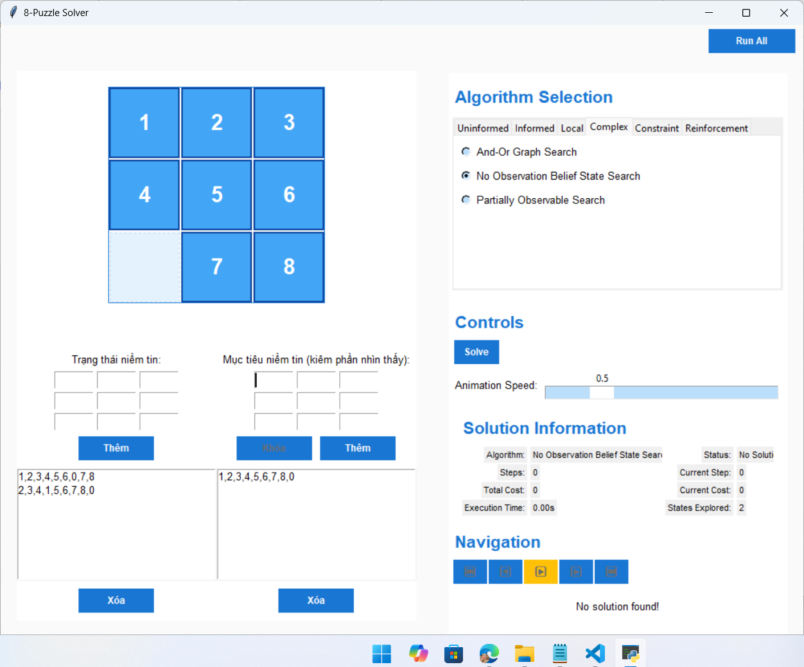

#### Giải Pháp

- Trả về đường đi từ trạng thái ban đầu đến mục tiêu, cùng số trạng thái đã duyệt. Nếu không tìm thấy, trả về danh sách rỗng.

#### Nhận Xét

- AND-OR Search hiệu quả trong môi trường chắc chắn.
- Partially Observable Search tốt cho bài toán có nhiễu, nhưng yêu cầu tài nguyên lớn.
- No Observation Search phù hợp khi không có quan sát, nhưng hiệu suất giảm khi không gian trạng thái lớn.

### 2.5. Các Thuật Toán Tìm Kiếm Có Ràng Buộc

#### Thành Phần Chính

- **Trạng Thái Ban Đầu**: Bảng rỗng (cho Backtracking CSP, AC-3) hoặc bảng 3x3 (cho Trial and Error).
- **Miền Giá Trị**: Các số từ 0 đến 8 cho mỗi ô.
- **Ràng Buộc**:
  - All-Different: Mỗi ô có giá trị duy nhất.
  - Vị trí ô trống: Đảm bảo số 0 ở đúng vị trí mục tiêu.
- **Hàm Heuristic**: Manhattan Distance.

#### Thuật Toán

1. **Backtracking CSP**:
   - Thử điền số vào ô trống, quay lui nếu không hợp lệ.
   - Đơn giản nhưng không hiệu quả với bài toán lớn.
   - 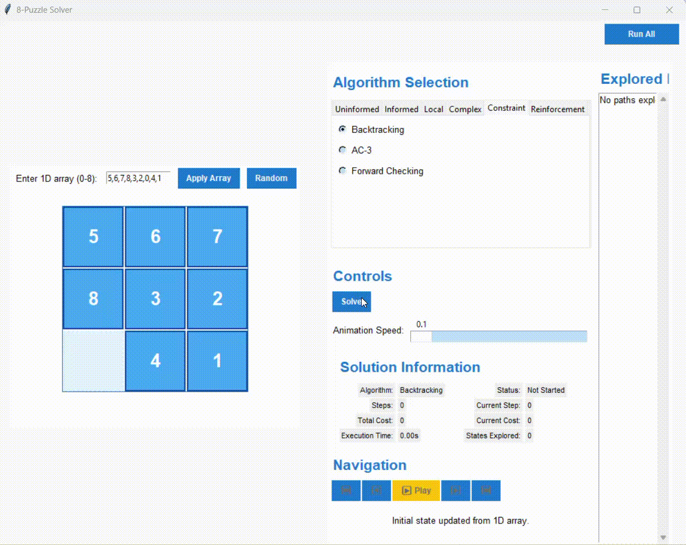
2. **AC-3**:
   - Kết hợp AC-3 để thu hẹp miền giá trị trước khi quay lui.
   - Tối ưu hơn Backtracking CSP.
   - 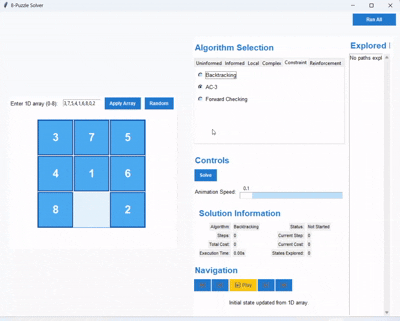
3. **Forward**:
   - Thử ngẫu nhiên các trạng thái lân cận, ưu tiên theo heuristic.
   - Nhanh nhưng không đảm bảo tối ưu.
   - 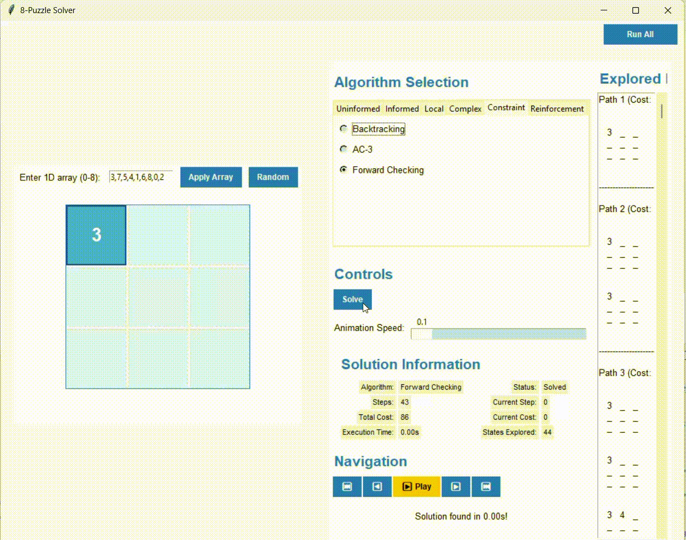

#### Giải Pháp

- Trả về đường đi từ trạng thái ban đầu đến mục tiêu, cùng số trạng thái đã duyệt. Nếu không tìm thấy, trả về danh sách rỗng.

### 2.6. Tìm Kiếm Trong Môi Trường Học Tăng Cường

#### Thành Phần Chính

- **Hàm Thưởng**:
  - Thưởng/phạt dựa trên thay đổi Manhattan Distance giữa các trạng thái.
- **Hàm Q-Value**: Lưu trữ giá trị kỳ vọng cho mỗi hành động trong trạng thái.
- **Chính Sách Hành Động**: Sử dụng epsilon-greedy để cân bằng khám phá và khai thác.
- **Hàm Heuristic**: Manhattan Distance để tính thưởng.

#### Thuật Toán

1. **Q-Learning**:
   - Sử dụng bảng Q để học giá trị kỳ vọng qua các tập huấn luyện.
   - Cập nhật Q-value dựa trên thưởng và giá trị tương lai.
   - Phù hợp khi không biết trước không gian trạng thái.
   - 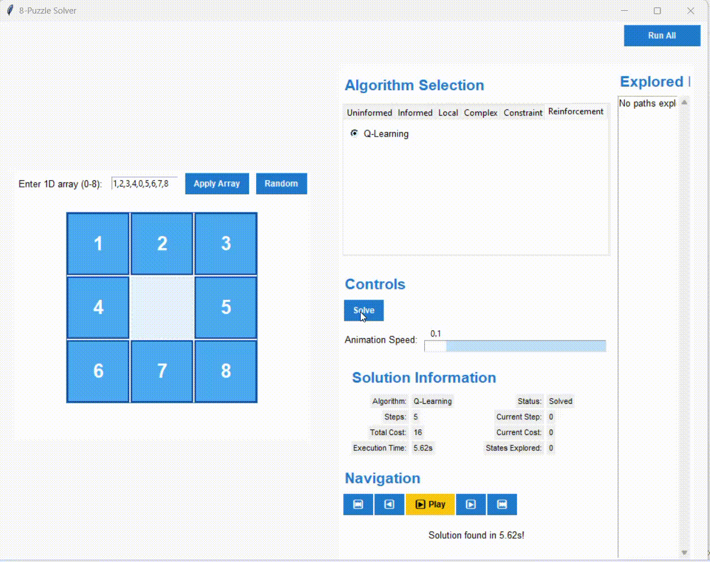

#### Giải Pháp

- Trả về đường đi từ trạng thái ban đầu đến mục tiêu, cùng số trạng thái đã duyệt. Nếu không tìm thấy, trả về danh sách rỗng.

#### Nhận Xét

- Q-Learning khả thi cho 8-Puzzle, đặc biệt trong môi trường không biết trước.
### 2.7. Bảng so sánh các thuật toán 
- 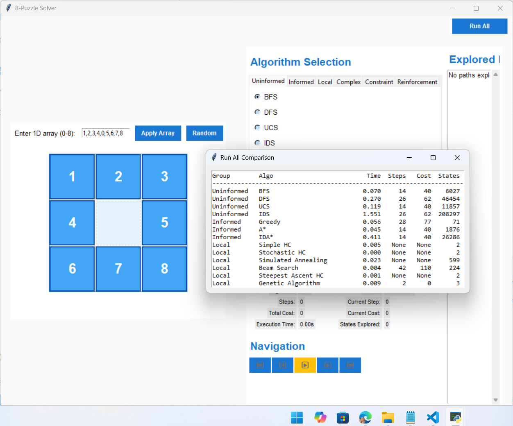

## 3. Kết Luận

Dự án đã xây dựng thành công 8-Puzzle với nhiều thuật toán tìm kiếm AI. Kết quả cho thấy mỗi thuật toán có ưu và nhược điểm riêng, tùy thuộc vào yêu cầu về tối ưu, bộ nhớ, và thời gian chạy. Giao diện Tkinter cung cấp trải nghiệm trực quan, cho phép người dùng nhập trạng thái, quan sát quá trình giải, và so sánh hiệu suất thuật toán.
